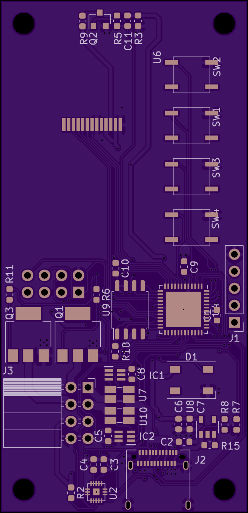

# Cheap-Feaver-Screener-PID-Control-PCB
PCB to control two heating elements wit i2c temp sensors.

# Features
 * USB-C with PD controller to request more power from chargers and battery packs.
 * Two heating element drivers that can drive 3A each.
 * Interfaces with external i2c or Dallas temp sensors.
 * 240x135 TFT display ad 4 buttons for a user interface.
 * Slot for an optional esp8266-01 module for wireless connectivity. (Status, MQTT updates, etc..)
 * Neopixel for indicating status
